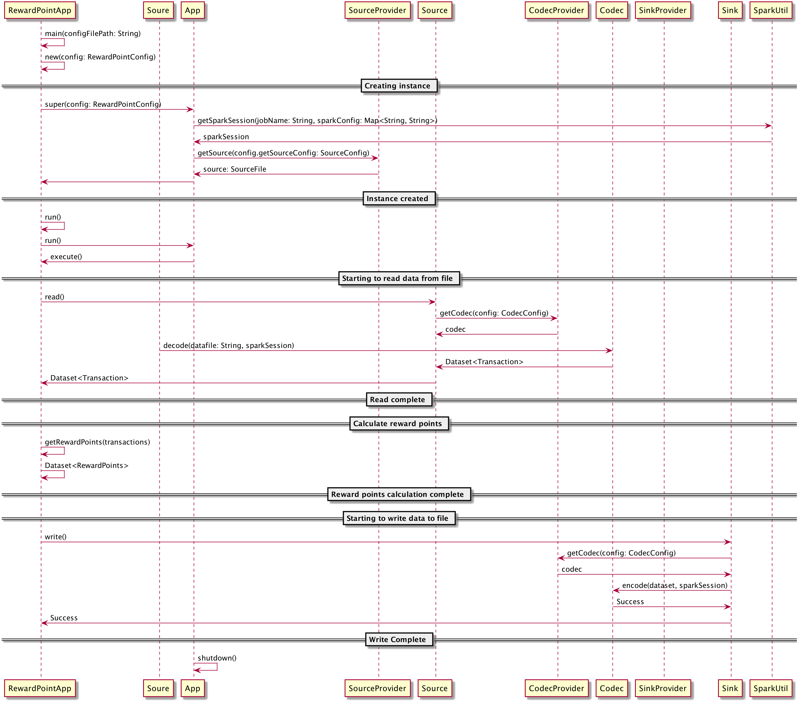

# Reward Point App

### Tech Stack
* Java
* Spark
* Drools (Rule Engine)

### Why I choose particularly this stack?
* **Spark**  
 The most viable reason for choosing Spark instead of Multithreaded solution was scalability.
 i.e App should work for 1B+ transactions.  
  
  At first I thought to go with Multithreaded solution (Single Write Multi Read buffer) but that was clearly not scaling
  for 1B+ transactions.  
    
    Then I thought of MapReduce. It can work with low memory and keeps part of files on disk. It brings them to memory
    for merging (which is our case to accumulate reward points for each customer).  
      
    However **spark** provides best of both the worlds. It also uses memory and spills partitions to disk only when
    required.
* Drools (Rule Engine)  
 I first thought of implementing rule engine with `Chain of responsibility` design pattern. But what I wanted was
 something where in future if I have to make changes to existing rule or to a a new rule, I don't have to make additions
 in code. I wanted something that is controlled by some configuration. This save us from a lot of things like -
 code reviews, testing.  
   
   Hence I looked upon the internet for available rule engines and used Drools. It's a Bussiness Rule Management System.
* Java  
 Major motivation to use java for implementing all this was my familiarity and experience with Java. 

### How is this App structured?
Mainly there are two packages which is of our interest.

* core  
It contains classes that are required by any app like our current RewardPoint App or any such App that we may write in
future that has same business use case like RewardPoint App.
* rewardpoint
It contains classes specific to RewardPoint App which is this assignment.

### How is this App modeled?
Any App can be broken into three components/layers -
* Input
* Business Processing
* Output

I maintain these three sections in a configuration file, which an app reads to determine `input source (source),
output (sink)`. Config file for RewardPoint App is [RewardPointConfig.yaml](src/main/resources/RewardPointConfig.yaml)

Few things about each section
* Source  
I have tried to keep source generic enough. Such that we can plugin any other source in future instead of CSV.
We can support HTTP, Kafka and others.

* Sink  
Same as source.

Currently Source and Sink are file based.  
Also we have some processing platform specific configs (in our case - spark) in config file.  

### Class Diagrams
* Config classe's structure  
  
So in here, RewardPointConfig is the config for our RewardPointApp.  
  It extends AppConfig, which contains common configs for an App, like JobName, SourceConfig, SparkConfig.  
    
    
* App classe's structure  

### Sequence Diagram

